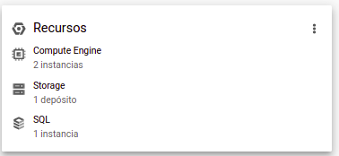
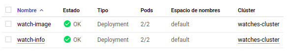
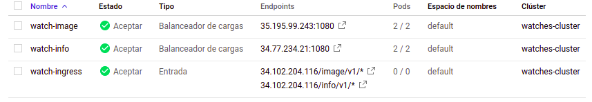

# WATCHES INFO & IMAGES
## WEB SERVICES - PART 2
### Deliverables
This project contains the following cmponents:
#### /info
* **The same web service for first assignment** The web service code in python
#### /image
* **server.py** The web service code in python. 
Contains proper caching headers **Expiration Cache-Control: max-age ETag**
* **.Dockerfile** Configuration file for build image in Docker
* **requirements.txt** Modules implemented

#### build.sh
* Rebuild the 2 images in Docker.

#### deploy.sh
* Rebuild the 2 images in Docker and push in Docker Hub repositories

#### all.yml 
* This file contains the configuration to deploy the images with 2 replicas + create the services + ingress and Kubernetes rolling upgrade

### Features and objectives reached
The web service has the following routes, where through HTTP request the service response:
``` markdown
* **GET** /image/v1/watch/{sku}
* **POST** /watch 
* **GET** /watch/{sku}
* **PUT** /watch/{sku}
* **DELETE** /watch/{sku}
* **GET** /watch/complete-sku/{prefix}
* **GET** /watch/find?"query_strings"
```

* The data persistence is possible to **Goggle Cloud SQL** with  info webservice
* The data persistence is possible to **Amazon S3** for  image webservice (this is provided)

### Google Cloud implementation
#### Ingress
* **Info Service**
http://34.102.204.116/info/v1/watch/CAC1111.BA0850
* **Image Service**
http://34.102.204.116/image/v1/watch/CAC1111.BA0850


#### Services URL
* **Resources used**



* **Work loads**



* **Services and Ingress**




### Test
Before to the Docker part, the web service was tested in the in the swagger environment, this test was possible thanks to the _image_openapi_v1.yaml_ given by the Lecture professor. The test got successful result.

[Test Link](https://editor.swagger.io/) (It is required to import the _image_openapi_v1.yaml_ file)
