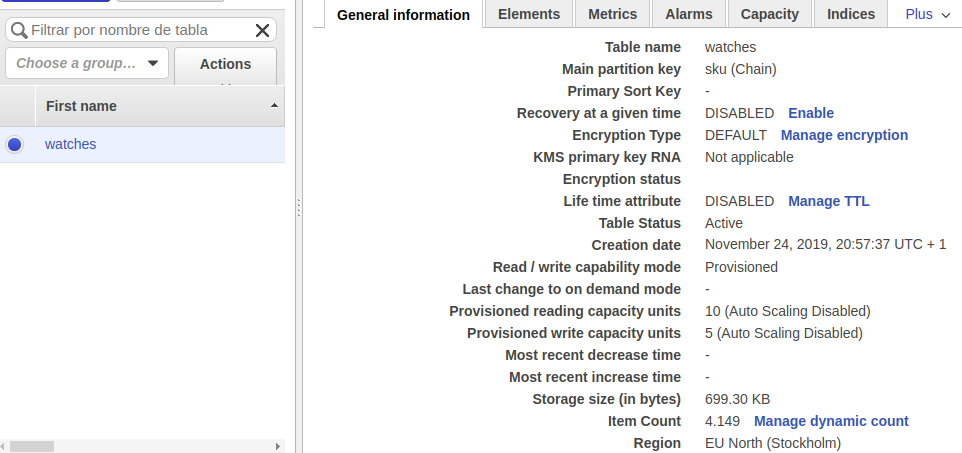
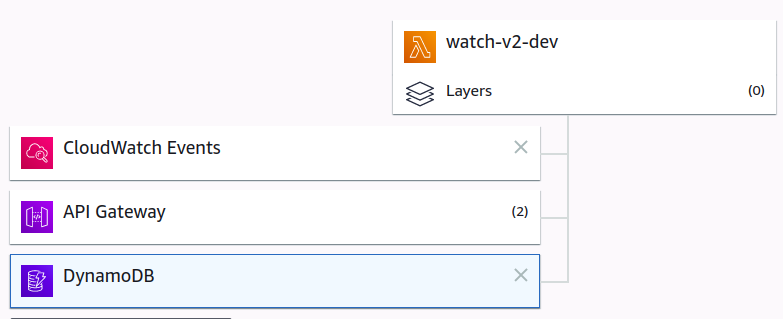
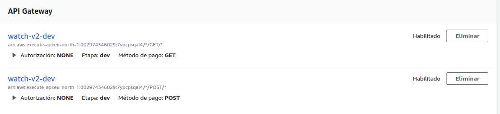

# WATCHES
## WEB SERVICES
### PART 3
### Deliverables
This project contains the following cmponents:
* **server.py** The web service code in python
* **run.sh** Script to run the web service 
* **initialize_dynamodb.sh** Script to run the creation and loading table in dynamoDB
* **/db** Folder that contains the **watches.json** database. This database was build with the tool [csvjson](https://www.csvjson.com/sql2json) 
and **loadDB.py** the python script to load the table 
* **info_openapi_v2.yaml** Description file for swagger
* **create_lambdas.sh** Script to generate a folder with virtual environment to install, to init and deploy [zappa](https://github.com/Miserlou/Zappa)
* **update_lambdas.sh** Script to update since a virtual environment the deployment previously made in aws.

### Features and objectives reached
The web service has the following routes, where through HTTP request the service response:
* **GET** /watch/{sku}
* **POST** /watch/

### AWS implementation

#### Dynamo DB 


#### Lambda AWS 


#### API Gateway AWS 


#### SAMPLE GET
https://7ypcpsqal4.execute-api.eu-north-1.amazonaws.com/dev/info/v2/watch/CV2115.FC6186

#### SAMPLE POST
https://7ypcpsqal4.execute-api.eu-north-1.amazonaws.com/dev/info/v2/watch
Execute it with a web client like POSTMAN or CURL with a simple body as follows:
```json
{
    "sku":"TEST_WATCH"
}
```

### Test
Before to the Docker part, the web service was tested in the in the swagger environment, this test was possible thanks to the _info_openapi_v2.yaml. The test got successful result.

[Test Link](https://editor.swagger.io/) (It is required to import the _info_openapi_v2.yaml_ file)
